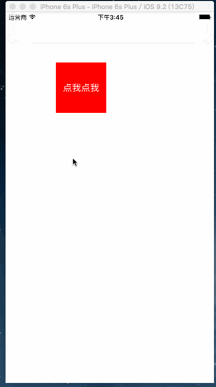

# SegmentPageController
注意： 这个是别人写的，我在看源码的时候，发现用了Manonsy,我觉得依赖性有点，就把Monansy去掉了，改成了纯代码的，以便以后查看，原文链接在这里：http://code.cocoachina.com/view/130207

请原作者多多包含，请勿见怪！

一句话实现分段控制器的切换,有木有感觉到最强封装...




### 废话不多说直接上代码...

```
LZPageViewController *pageVc = [[LZPageViewController alloc] initWithTitles:@[@"交易成功",@"待发货",@"配送中",@"待结算",] controllersClass:@[[PageCell1Controller class],[PageCell1Controller class],[PageCell2Controller class],[PageCell2Controller class]]];
```
